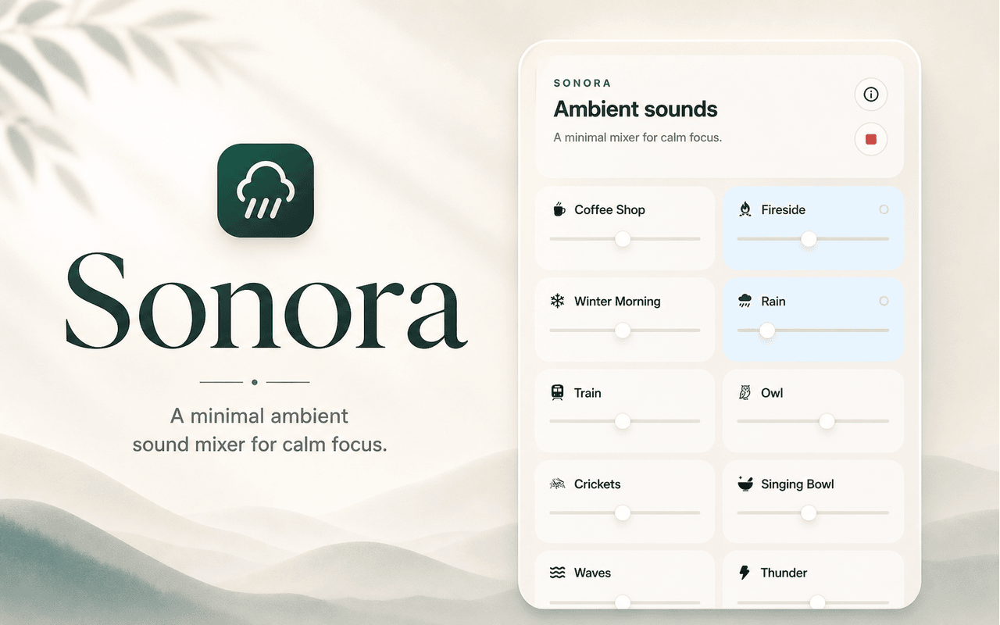

# Sonora

Sonora is a minimal Chrome extension for mixing ambient sounds. It lets you play multiple layers at the same time and control the volume of each one independently.

## Features

- Click the extension icon to open the mixer
- Play multiple ambient sounds together
- Adjust the volume of each sound separately
- Keep playback running in the background

## Included sounds

- Coffee Shop
- Crickets
- Fireside
- Rain
- Singing Bowl
- Thunder
- Train
- Waves
- White Noise
- Wind Chimes
- Winter Morning
- Owl

## Load in Chrome

1. Open `chrome://extensions`
2. Enable **Developer mode**
3. Click **Load unpacked**
4. Select this project folder

## Notes

- The extension uses an offscreen document to keep audio playing after the popup closes.
- Sound volume is remembered while the extension remains installed.
- You can mix as many sounds together as you like.

## Support

If you enjoy Sonora, use the **Buy Me a Coffee** link in the about panel.
